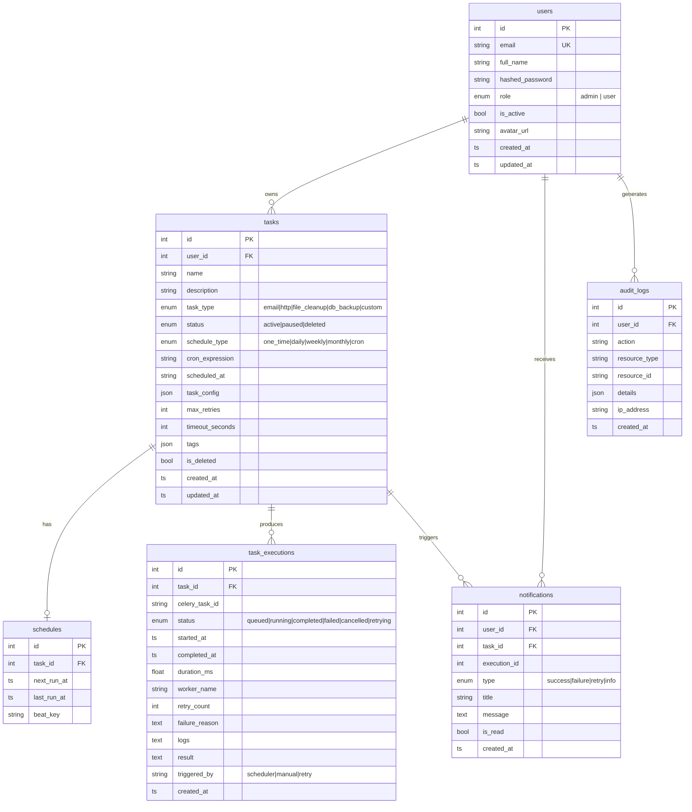
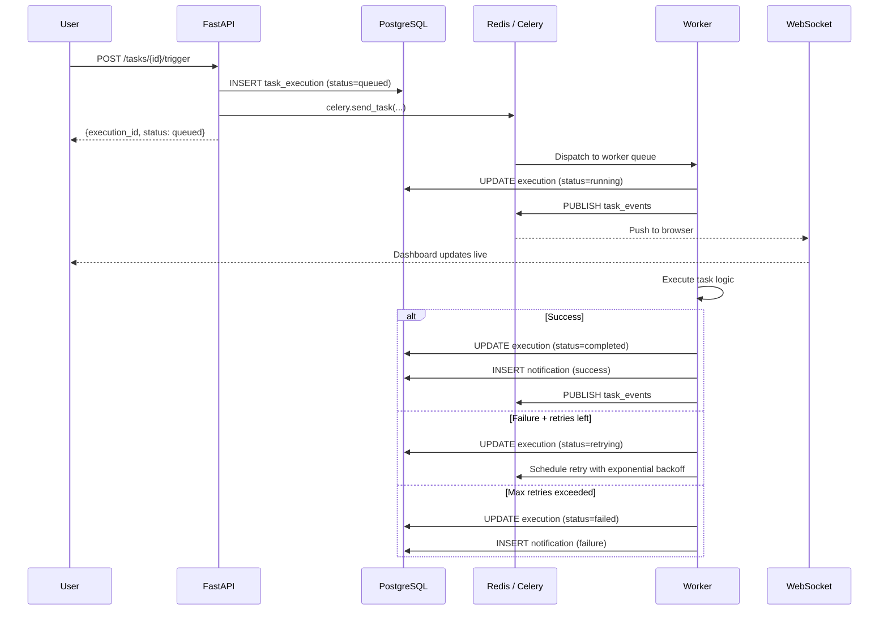

# ⚡ TaskQ — Distributed Task Queue & Job Scheduler

> A production-grade, SaaS-ready distributed task scheduler built with **FastAPI · PostgreSQL · Redis · Celery · React**.  
> Deploy with a single command. Demonstrate live in every interview.

---

## ✨ Features

| Area | What's included |
|------|----------------|
| **Auth** | Register · Login · JWT + Refresh token · Password hashing (bcrypt) · RBAC (Admin / User) · Change password |
| **Tasks** | Create · Edit · Delete · Pause · Resume · Trigger now · Clone · Search · Filter · Paginate |
| **Scheduling** | One-time · Daily · Weekly · Monthly · Cron expressions (Celery Beat + RedBeat) |
| **Task types** | Email · HTTP API call · File cleanup · Database backup · Custom Python |
| **Execution** | Async workers · Auto-retry · Exponential backoff · Cancellation · Execution logs |
| **Real-time** | WebSocket push — dashboard updates without refresh |
| **Analytics** | Success rate · Execution trends · Task-type breakdown · Top failing tasks |
| **Notifications** | In-app alerts for completed / failed / retrying jobs |
| **Audit logs** | Every state-changing action recorded (login, create, update, retry, delete) |
| **Admin** | User management · Worker status · Role-based access |
| **Ops** | `/health` liveness · `/ready` readiness · Flower monitoring UI · Structured logging |

---

## 🏗 Architecture

```mermaid
graph TB
    subgraph Frontend["Frontend (React + Vite)"]
        UI[Dashboard / Tasks / Analytics]
        WS[WebSocket Client]
    end

    subgraph Gateway["Nginx (port 3000)"]
        NG[Reverse Proxy]
    end

    subgraph Backend["Backend (FastAPI · port 8000)"]
        API[REST API /api/v1]
        WSS[WebSocket /ws/{userId}]
        direction LR
        API --> |Router → Service → Repository| DB
        API --> |Publish events| RP[(Redis Pub/Sub)]
        WSS --> RP
    end

    subgraph Workers["Background Workers"]
        CW[Celery Worker]
        CB[Celery Beat]
        FL[Flower UI · port 5555]
    end

    subgraph Storage["Persistence"]
        DB[(PostgreSQL)]
        RQ[(Redis · Queues / Cache)]
    end

    UI  --> NG
    WS  --> NG
    NG  --> API
    NG  --> WSS
    NG  --> FL

    CB  --> RQ
    CW  --> RQ
    CW  --> DB
    API --> RQ
```

---

## 🗄 Database Schema (ER Diagram)



---

## 🔄 Execution Flow



---

## 📁 Project Structure

```
taskq/
├── .env.example                   # Copy to .env — fill every value
├── docker-compose.yml             # One-command full stack
│
├── backend/
│   ├── Dockerfile
│   ├── entrypoint.sh              # waits for Postgres → runs migrations → starts API
│   ├── requirements.txt
│   ├── alembic.ini
│   ├── alembic/
│   │   ├── env.py                 # async migration env wired to Base.metadata
│   │   └── versions/
│   │       └── 6d496929a9e4_initial_schema.py
│   └── app/
│       ├── main.py                # FastAPI factory, /health, /ready
│       ├── core/
│       │   ├── config.py          # Pydantic Settings — fail-fast on missing vars
│       │   ├── database.py        # Async SQLAlchemy 2.0 engine
│       │   ├── redis.py           # Singleton async Redis pool
│       │   ├── security.py        # bcrypt + JWT + refresh token
│       │   ├── logging.py         # Structured logging (JSON in prod)
│       │   └── dependencies.py    # get_current_user, get_current_admin, Pagination
│       ├── models/                # SQLAlchemy ORM models
│       ├── schemas/               # Pydantic V2 request/response schemas
│       ├── repositories/          # DB query layer (Repository pattern)
│       ├── services/              # Business logic layer
│       ├── routers/               # Thin HTTP controllers
│       ├── workers/
│       │   ├── celery_app.py      # Celery factory, queue routing
│       │   └── startup.py        # Worker-ready signal → seeds demo admin
│       ├── tasks/
│       │   ├── base_task.py       # Shared lifecycle: run → notify → broadcast
│       │   ├── email_task.py
│       │   ├── http_task.py
│       │   ├── file_cleanup_task.py
│       │   ├── db_backup_task.py
│       │   └── custom_task.py
│       ├── middleware/
│       │   └── request_logger.py
│       └── tests/
│
└── frontend/
    ├── Dockerfile
    ├── nginx.conf                 # SPA routing + /api proxy + WS upgrade
    ├── vite.config.js
    ├── tailwind.config.js
    └── src/
        ├── api/                   # Axios client + per-domain API modules
        ├── context/               # AuthContext
        ├── hooks/                 # useWebSocket
        ├── components/            # Layout, UI, CreateTaskModal
        ├── pages/                 # Dashboard, Tasks, History, Analytics …
        └── utils/                 # helpers (fmtDate, fmtDuration, …)
```

---

## 🚀 Quick Start

### Prerequisites
- Docker & Docker Compose

### 1 — Configure environment

```bash
cp .env.example .env
```

Edit `.env`:

```dotenv
SECRET_KEY=your-random-64-char-hex-string   # python -c "import secrets; print(secrets.token_hex(32))"
POSTGRES_PASSWORD=a-strong-database-password
GEMINI_API_KEY=                              # leave empty if not using AI features
```

### 2 — Start everything

```bash
docker compose up --build
```

That single command:
1. Starts **PostgreSQL** and waits until it's healthy
2. Starts **Redis** and waits until it's healthy
3. Runs **Alembic migrations** automatically
4. Seeds a **demo admin account** (`admin@taskq.io` / `Password1`)
5. Starts the **FastAPI** backend on `:8000`
6. Starts **Celery Worker** (4 concurrent workers across 4 queues)
7. Starts **Celery Beat** (Redis-backed schedule with RedBeat)
8. Starts **Flower** monitoring UI on `:5555`
9. Builds and serves the **React** frontend on `:3000`

### 3 — Open the app

| Service | URL |
|---------|-----|
| **App**      | http://localhost:3000 |
| **API Docs** | http://localhost:8000/api/docs |
| **Flower**   | http://localhost:5555 |
| **Health**   | http://localhost:8000/health |
| **Ready**    | http://localhost:8000/ready |

Login: `admin@taskq.io` / `Password1`

---

## 🌐 API Reference

### Auth
| Method | Path | Auth | Description |
|--------|------|------|-------------|
| POST | `/api/v1/auth/register`        | ○ | Register new user |
| POST | `/api/v1/auth/login`           | ○ | Login → JWT + refresh token |
| POST | `/api/v1/auth/refresh`         | ○ | Rotate refresh token |
| POST | `/api/v1/auth/logout`          | ○ | Revoke refresh token |
| GET  | `/api/v1/auth/me`              | ✓ | Current user profile |
| PUT  | `/api/v1/auth/me`              | ✓ | Update profile |
| POST | `/api/v1/auth/change-password` | ✓ | Change password |

### Tasks
| Method | Path | Description |
|--------|------|-------------|
| POST   | `/api/v1/tasks`               | Create task |
| GET    | `/api/v1/tasks`               | List (paginated, filtered) |
| GET    | `/api/v1/tasks/{id}`          | Get task detail |
| PUT    | `/api/v1/tasks/{id}`          | Update task |
| DELETE | `/api/v1/tasks/{id}`          | Soft delete |
| POST   | `/api/v1/tasks/{id}/pause`    | Pause scheduling |
| POST   | `/api/v1/tasks/{id}/resume`   | Resume scheduling |
| POST   | `/api/v1/tasks/{id}/trigger`  | Trigger immediately |

### Executions
| Method | Path | Description |
|--------|------|-------------|
| GET    | `/api/v1/executions`              | Execution history |
| GET    | `/api/v1/executions/{id}`         | Execution detail |
| POST   | `/api/v1/executions/{id}/retry`   | Retry failed execution |
| POST   | `/api/v1/executions/{id}/cancel`  | Cancel queued/running |

### Dashboard & Analytics
| Method | Path | Description |
|--------|------|-------------|
| GET    | `/api/v1/dashboard/stats` | Aggregated stats (Redis cached) |
| GET    | `/api/v1/analytics`       | Trend data, breakdowns |

### Admin (admin role required)
| Method | Path | Description |
|--------|------|-------------|
| GET    | `/api/v1/admin/users`                        | All users |
| PATCH  | `/api/v1/admin/users/{id}/activate`          | Enable / disable user |
| GET    | `/api/v1/admin/workers/status`               | Live worker stats |

---

## 🔒 Security Design

- **No hardcoded secrets** — `SECRET_KEY` and `DATABASE_URL` have no defaults; the process exits with a clear message if unset
- **bcrypt** password hashing (work factor 12)
- **Short-lived JWTs** (access: 30 min) + **revocable refresh tokens** stored in Redis
- **RBAC** — `admin` role checked at the dependency level, not scattered in business logic
- **Rate limiting** — Redis sliding-window counter, 60 req/min per user
- **Audit log** — every login, creation, update, retry, deletion recorded with IP and user agent

---

## 🧪 Running Tests

```bash
cd backend
pip install -r requirements.txt
pytest app/tests/ -v
```

Tests use **SQLite** (async) and **fakeredis** — no real Postgres or Redis needed.

---

## 📦 Deployment on Render

1. Fork this repo
2. Create a **Postgres** and **Redis** instance on Render
3. Create a **Web Service** for `backend/` — set `Start Command` to `./entrypoint.sh`
4. Create a **Web Service** for `frontend/` — static build with `npm run build`
5. Set environment variables from `.env.example` in the Render dashboard
6. Render auto-deploys on every push — zero code changes needed

---

## 💡 Interview Talking Points

| Question | Answer |
|----------|--------|
| Why Celery over raw threads? | Celery provides distributed task execution, automatic retry, dead-letter queue concepts, and a scheduling backend (Beat). Workers scale horizontally by adding more `worker` containers |
| How does retry work? | Tasks use `exponential backoff` — retry 1 waits 60s, retry 2 waits 120s, retry 3 waits 240s. Max retries configurable per task |
| How does caching work? | Dashboard stats are cached in Redis with a 30s TTL. The cache key includes the user ID. Any document change invalidates via TTL expiry |
| How does the real-time dashboard update? | Workers publish to a Redis Pub/Sub channel `task_events`. The FastAPI WebSocket endpoint subscribes and forwards to the browser. No polling |
| Why RedBeat? | Celery Beat's default scheduler stores state on disk — not safe in a container. RedBeat stores the schedule in Redis, making it stateless and replicable |
| How is RBAC enforced? | `get_current_admin` is a FastAPI dependency that extends `get_current_user`. Any endpoint that lists dependencies `get_current_admin` automatically requires the admin role. No decorator magic needed |
| Why Repository pattern? | Separates SQL queries from business logic. Services test cleanly by replacing the repository with a mock. Adding a new DB (e.g. MongoDB) only requires a new repository class |
